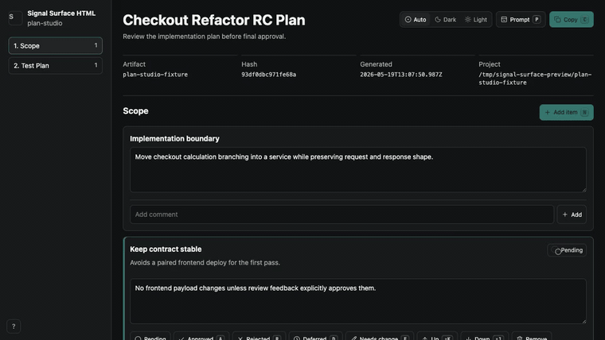

# Surface Signal HTML

[](https://github.com/rgrvlsk/signal-surface-html/actions/workflows/ci.yml)
[](https://skills.sh/rgrvlsk/signal-surface-html)

Surface Signal HTML turns plans, reviews, risk lists, research, and roadmap decisions into self-contained HTML review artifacts.

Use it when Markdown is too flat: too many decisions, too much reviewer feedback, or too much context to carry safely into the next agent session.



## What It Does

- Routes a request to the right surface with `$surface-signal-html` or `$s2-html`.
- Builds source-backed artifacts under `/tmp/surface-signal-html/<artifact-id>/`.
- Renders offline `dist/index.html` files with comments, decisions, prompt export, and keyboard shortcuts.
- Keeps `src/**`, `surface.json`, and `feedback/**` authoritative; compiled HTML is disposable.
- Works as a full plugin, a package CLI, a skills.sh install, or a standalone copied skill.

## Quick Start

```bash
npx skills add rgrvlsk/signal-surface-html --skill surface-signal-html
```

Ask the router to pick the surface:

```text
$surface-signal-html turn this release review into an approval board
```

Or call a surface directly:

```text
$plan-studio turn this implementation plan into an editable RC review
$verdict-rundown create an approval board for these regressions
$research-atlas synthesize these sources into an evidence review
```

## When It Fits

| Use Surface Signal for | Use something else for |
| --- | --- |
| Plans that need approval, edits, and open-question tracking. | Simple one-off answers. |
| Review queues with approve/reject/defer decisions. | Code execution or browser automation. |
| Research where claims, sources, and confidence need to stay visible. | General agent methodology or response style. |
| Follow-up sessions that need exported context, not chat memory. | Static docs that will never be reviewed interactively. |

See [Comparison](docs/COMPARISON.md) for positioning against common independent skill/plugin patterns.

## Skill Catalog

| Skill | Best for |
| --- | --- |
| `surface-signal-html` | Router for choosing the right surface. |
| `s2-html` | Shorthand alias for `surface-signal-html`. |
| `plan-studio` | Editable RC plans and implementation proposals. |
| `verdict-rundown` | Approve/reject/defer boards for reviews, regressions, and audit items. |
| `feature-storyboard` | Comment-only feature and workflow explainers. |
| `keynote-canvas` | Projected HTML presentations and readouts. |
| `adr-navigator` | Architecture options, constraints, consequences, and ADR-ready export. |
| `risk-radar` | Security, release, operational, compliance, and product risks. |
| `roadmap-council` | Prioritization, deferrals, dependencies, and stakeholder comments. |
| `qa-triage-wall` | Test failures, QA reports, flaky failures, and release blockers. |
| `migration-map` | Rollouts, migrations, compatibility gates, and rollback plans. |
| `research-atlas` | Source-backed claims, citations, confidence, and open questions. |

## Install Paths

| Need | Command |
| --- | --- |
| List skills | `npx skills add rgrvlsk/signal-surface-html --list` |
| Install router | `npx skills add rgrvlsk/signal-surface-html --skill surface-signal-html` |
| Install one surface | `npx skills add rgrvlsk/signal-surface-html --skill plan-studio` |
| Install native adapters | `npx --yes surface-signal-html@latest install --target all --out .` |
| Read compiler contract | `npx --yes surface-signal-html@latest contract` |

Standalone or copied skills resolve runtime in this order:

1. Bundled `surface-kit` scripts in a full repo/plugin install.
2. `npx --yes surface-signal-html@latest`.
3. `npx --yes github:rgrvlsk/signal-surface-html`.
4. A modest standalone HTML fallback with inline CSS/JS, comments, decisions, local state, and follow-up prompt export when useful.

The fallback is useful, but not source-backed. It does not pretend to replace the full compiler/runtime.

## Artifact Model

```text
/tmp/surface-signal-html/<artifact-id>/
  surface.json
  src/
    document.json
    content/*.md
    data/*.json
    assets/*
    app.jsx
    theme.css
  feedback/
    imported-feedback.json
  dist/
    index.html
```

Edit source files and rebuild. Do not patch `dist/index.html`.

If only compiled HTML exists, use its exported prompt or feedback payload to regenerate source.

## Runtime UX

- Dark-first, offline, self-contained HTML.
- Auto/dark/light theme control.
- Context-aware shortcuts: `P`, `C`, `?`, `Esc`, `1-9`, `J/K`, `A/R/D/E`, `Shift+J/K`.
- Prompt drawer with Clipboard API copy and manual-copy fallback.
- Build-time Lucide Static icons; no runtime icon CDN.

## Development

```bash
npm install
npm run publish:check
npm pack --dry-run
```

Focused checks:

```bash
npm test
npm run render:fixtures
npm run size:check
```

Docs:

- [Architecture](docs/ARCHITECTURE.md)
- [Agent Compatibility](docs/AGENT_COMPATIBILITY.md)
- [skills.sh Readiness](docs/SKILLS_SH.md)
- [Comparison](docs/COMPARISON.md)

## License

MIT
